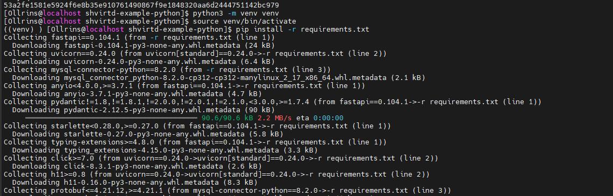
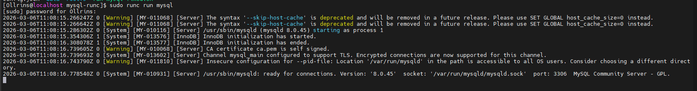

# Домашнее задание к занятию 5. «Практическое применение Docker»

## Задание 1: FastAPI приложение с MySQL


### 1. Создание Dockerfile.python (single stage)
<p align="center">
  
  <br>
  <em>Рисунок 1 - Создание Dockerfile.python с базовым образом python:3.12-slim и конструкцией COPY .</em>
</p>

### 2. Создание .dockerignore
<p align="center">
  
  <br>
  <em>Рисунок 2 - Файл .dockerignore для исключения ненужных файлов</em>
</p>

### 3. Сборка и тестирование single stage образа
<p align="center">
  
  <br>
  <em>Рисунок 3 - Сборка образа командой docker build -f Dockerfile.python -t test-app . </em>
</p>

### 4. Multistage сборка
<p align="center">
  
  <br>
  <em>Рисунок 4 - Изменение Dockerfile.python на multistage сборку</em>
</p>

<p align="center">
  
  <br>
  <em>Рисунок 5 - Сборка multistage образа test-app-multi</em>
</p>

### 5. ✨ Запуск с venv (без Docker)
<p align="center">
  
  <br>
  <em>Рисунок 6 - Запуск MySQL в контейнере для локальной разработки. Создание и активация виртуального окружения, установка зависимостей. </em>
</p>

<p align="center">
  
  <br>
  <em>Рисунок 7 - Запуск приложения через uvicorn на порту 5001 (подключение к БД успешно)</em>
</p>

<p align="center">
  
  <br>
  <em>Рисунок 8 - Проверка работы приложения через curl (получено предупреждение)</em>
</p>

### 6. ✨ Добавление ENV переменной DB_TABLE
<p align="center">
  
  <br>
  <em>Рисунок 9 - Добавление переменной db_table в секцию конфигурации</em>
</p>

<p align="center">
  
  <br>
  <em>Рисунок 10 - Запуск приложения с DB_TABLE='my_custom_table' (таблица создана)</em>
</p>

<p align="center">
  
  <br>
  <em>Рисунок 11 - Проверка работы с кастомной таблицей через curl</em>
</p>

## Задание 2
<p align="center">
  
  <br>
  <em>Рисунок 12 - Отчет сканирования</em>
</p>

## Задание 3
<p align="center">
  
  <br>
  <em>Рисунок 13 - Скриншот sql-запроса</em>
</p>

## Задание 4
<p align="center">
  
  <br>
  <em>Рисунок 14 - Скриншот sql-запроса</em>  <br>
  <em>Ссылка на fork https://github.com/Ollrins/shvirtd-example-python.git</em>
</p>
## Необязательная часть
<p align="center">
  
  <br>
  <em>Рисунок 15 - Remote ssh context</em>
</p>

## Задание 5
<p align="center">
  
  <br>
  <em>Рисунок 16 - Скрипт, cron-task и скриншот с несколькими резервными копиями в "/opt/backup" (из образа schnitzler/mysqldump не получилось) </em>
</p>

## Задание 6
<p align="center">
  
  <br>
  <em>Рисунок 17 -Скриншот dive, вроде что-то пошло не так)</em>
</p>
<p align="center">
  
  <br>
  <em>Рисунок 18 - Скриншот terraform</em>
</p>

## Задание 6.1
<p align="center">
  
  <br>
  <em>Рисунок 19 - Скриншот docker cp </em>
</p>

## Задание 6.2
<p align="center">
  
  <br>
  <em>Рисунок 20 - Скриншот docker build и Dockerfile </em>
</p>

## Задание 7
<p align="center">
  
  <br>
  
  <br>
  
    <br>
  <em>Рисунок 21 - Скриншот runC, дальше не получилось </em>
</p>


## Задача 1: Работа с репозиторием и Docker

1. Fork репозитория
```bash
git clone https://github.com/Ollrins/shvirtd-example-python.git
cd /opt/shvirtd-example-python
```
2. Создание Dockerfile.python (single stage)

Файл Dockerfile.python:
```bash
FROM python:3.12-slim

WORKDIR /app

COPY . .

RUN pip install --no-cache-dir -r requirements.txt

CMD ["uvicorn", "main:app", "--host", "0.0.0.0", "--port", "5000"]
```
3. Создание .dockerignore
Файл .dockerignore:
```bash
text
venv/
__pycache__/
*.pyc
.git
.gitignore
README.md
.env
Dockerfile
.dockerignore
```
4. Сборка и тестирование single stage образа
```bash
docker build -f Dockerfile.python -t test-app .
docker run -d --name test-app -p 5000:5000 test-app
curl http://localhost:5000
```
Результат: приложение отвечает с подсказкой об использовании порта 8090 (работает корректно)

5. Multistage сборка
Файл Dockerfile.python (multistage):
```bash
# Dockerfile.python - multistage version

# Stage 1: Builder
FROM python:3.12-slim AS builder

WORKDIR /app

COPY requirements.txt .

RUN pip install --user --no-cache-dir -r requirements.txt

# Stage 2: Финальный образ
FROM python:3.12-slim

WORKDIR /app

COPY --from=builder /root/.local /root/.local
COPY . .

ENV PATH=/root/.local/bin:$PATH

CMD ["uvicorn", "main:app", "--host", "0.0.0.0", "--port", "5000"]
```
Сборка multistage образа:

```bash
docker build -f Dockerfile.python -t test-app-multi .
docker run -d --name test-app-multi -p 5001:5000 test-app-multi
curl http://localhost:5001
```
Результат: multistage образ успешно собран и работает

6. Запуск через docker-compose
Файл compose.yaml в репозитории:
Запуск:
```bash
docker compose up -d
```
Результат: оба контейнера запущены, MySQL healthy

7. ✨ Дополнительная часть: Запуск с venv (без Docker)
Запуск MySQL в контейнере:
```bash
docker run -d \
  --name mysql-local \
  -e MYSQL_ROOT_PASSWORD=rootpass \
  -e MYSQL_DATABASE=example \
  -e MYSQL_USER=app \
  -e MYSQL_PASSWORD=very_strong \
  -p 3309:3306 \
  mysql:8
  ```
Настройка виртуального окружения:
```bash
python3 -m venv venv
source venv/bin/activate
pip install -r requirements.txt
  ```
Запуск приложения:
```bash
export DB_HOST='127.0.0.1'
export DB_PORT='3309'
export DB_USER='app'
export DB_PASSWORD='very_strong'
export DB_NAME='example'
export DB_TABLE='requests'

uvicorn main:app --host 0.0.0.0 --port 5001 --reload
  ```
Результат: приложение запущено, подключение к БД успешно

8. ✨ Дополнительная часть: Добавление ENV переменной для таблицы
Изменения в main.py (конфигурация):
```bash
python
# --- 1. Конфигурация ---
db_host = os.environ.get('DB_HOST', '127.0.0.1')
db_port = os.environ.get('DB_PORT', '3309')
db_user = os.environ.get('DB_USER', 'app')
db_password = os.environ.get('DB_PASSWORD', 'very_strong')
db_name = os.environ.get('DB_NAME', 'example')
db_table = os.environ.get('DB_TABLE', 'requests')  # Новая переменная
  ```
Изменения в запросах (пример для index):
```bash
python
query = f"INSERT INTO {db_table} (request_date, request_ip) VALUES (%s, %s)"
  ```
Тестирование с кастомной таблицей:

```bash
export DB_TABLE='my_custom_table'
uvicorn main:app --host 0.0.0.0 --port 5002 --reload
  ```
Результат: при запуске видно таблица 'my_custom_table' готова к работе

Проверка работы:

```bash
curl http://localhost:5002
  ```
Ответ: "TIME: 2026-03-03 09:53:22, IP: похоже, что вы направляете запрос в неверный порт..."

## Задача 2: Yandex Cloud Container Registry

1. Установка и настройка Yandex Cloud CLI

#### Установка yc
```bash
curl -sSL https://storage.yandexcloud.net/yandexcloud-yc/install.sh | bash
exec -l $SHELL
  ```
#### Инициализация (выполнить вход, выбрать облако и каталог)
```bash
yc init
  ```
#### Проверка
```bash
yc config list
  ```
2. Создание Container Registry

#### Создать registry с именем test
```bash
yc container registry create --name test
  ```
#### Посмотреть созданный registry и сохранить ID
```bash
yc container registry list
export REGISTRY_ID=$(yc container registry get --name test --format json | jq -r '.id')
echo $REGISTRY_ID
  ```
3. Настройка аутентификации Docker

#### Настроить Docker для работы с Yandex Cloud
```bash
yc container registry configure-docker
  ```
4. Сборка и загрузка образа (без BuildKit)

#### Перейти в папку проекта
```bash
cd ~/shvirtd-example-python
```
#### Отключить BuildKit
```bash
export DOCKER_BUILDKIT=0
  ```
#### Собрать образ для конкретной платформы
```bash
docker build --platform linux/amd64 \
  -f Dockerfile.python \
  -t cr.yandex/$REGISTRY_ID/test-app:latest .
  ```
#### Загрузить образ в registry
```bash
docker push cr.yandex/$REGISTRY_ID/test-app:latest
  ```
5. Проверка загруженного образа

#### Посмотреть список образов в registry
```bash
yc container image list --registry-name test
  ```
#### Сохранить ID образа (нужен для сканирования)
```bash
export IMAGE_ID=$(yc container image list --registry-name test --format json | jq -r '.[0].id')
echo $IMAGE_ID
  ```
6. Сканирование образа на уязвимости

#### Запустить сканирование
```bash
yc container image scan --id $IMAGE_ID
  ```
#### Подождать немного и проверить результат
```bash
yc container image get-last-scan-result --image-id  $IMAGE_ID
  ```
7. Сохранение отчета

#### Сохранить отчет в JSON файл
```bash
yc container image get-last-scan-result --image-id $IMAGE_ID --format json > scan-report.json
  ```
#### Посмотреть содержимое отчета
```bash
cat scan-report.json
  ```
8. Дополнительные полезные команды

#### Если нужно удалить образ из registry
```bash
yc container image delete --id $IMAGE_ID
  ```
#### Если нужно удалить registry
```bash
yc container registry delete --name test
  ```
#### Посмотреть все образы в registry
```bash
yc container image list --registry-name test
  ```
## Задача 3:  

1. Создание и запуск проекта
Был создан основной файл compose.yaml, который через директиву include подключает proxy.yaml. В нём описаны сервисы web и db с фиксированными IP-адресами в сети backend.

#### Запуск проекта в фоне
```bash
docker compose up -d
  ```
#### Подключение к MySQL
```bash
docker exec -it mysql-db mysql -uroot -ppassword
  ```
```bash
sql
-- Просмотр всех баз данных
show databases;

-- Переключение на нужную БД
use virtd;

-- Просмотр списка таблиц
show tables;

-- Вывод первых 10 записей из таблицы
SELECT * from requests LIMIT 10;

-- Выход
exit
  ```
  
## Задача 4: Yandex Cloud ВМ

Cкрипт, который скачает ваш fork-репозиторий в каталог /opt и запустит проект целиком.
```bash
#!/bin/bash

cd /opt

git clone https://github.com/Ollrins/shvirtd-example-python.git
cd /opt/shvirtd-example-python

docker compose up -d

sleep 10
  ```

Задание 4.6: Remote SSH Context

Команды для настройки и проверки:
#### 1. Создать SSH ключ (если нет)
```bash
ssh-keygen -t rsa -b 4096
  ```
#### 2. Скопировать ключ на удаленный сервер
```bash
ssh-copy-id ollrins@IP
  ```
#### 3. Проверить подключение без пароля
```bash
ssh ollrins@IP "echo 'SSH работает'"
  ```
#### 4. Создать Docker context
```bash
docker context create remote-server \
  --description "Remote VM in Yandex Cloud" \
  --docker "host=ssh://ollrins@IP"
  ```
#### 5. Показать список контекстов
```bash
docker context ls
  ```
#### 6. Выполнить команды на удаленном сервере через контекст
```bash
docker --context remote-server ps -a
docker --context remote-server images
docker --context remote-server compose -f /opt/shvirtd-example-python/compose.yaml ps
  ```
#### 7. Переключиться на удаленный контекст
```bash
docker context use remote-server
docker ps -a  # теперь показывает контейнеры на удаленной ВМ
  ```
#### 8. Вернуться на локальный контекст
```bash
docker context use default
  ```
#### 9. Удалить контекст
```bash
docker context rm remote-server
  ```
  
## Задача 5: Резервное копирование MySQL
Файлы для создания:
1. Конфигурационный файл /opt/backup-config.env (не в git!)
#### Создать файл с секретными данными
```bash
sudo nano /opt/backup-config.env
  ```
Содержимое:
#### Конфигурация для резервного копирования MySQL
```bash
DB_HOST="mysql-db"
DB_USER="root"
DB_PASSWORD="password"
DB_NAME="virtd"
CONTAINER_NETWORK="shvirtd-example-python_backend"
BACKUP_DIR="/opt/backup"
 ```
#### Защитить файл (только root может читать)
```bash
sudo chmod 600 /opt/backup-config.env
sudo chown root:root /opt/backup-config.env
 ```
2. Скрипт резервного копирования /opt/backup.sh
!!!!!!!!!!!!!!!!!!!!!!!!!!!!!!!!!!!!!!!!!!!!!!!!!!!!!!!!!!!!!!!!!!!!!!!!
```bash
 ```
#### Сделать скрипт исполняемым
```bash
sudo chmod +x /opt/backup.sh
 ```
3. Тестирование ручного запуска

#### Запустить скрипт вручную
```bash
sudo /opt/backup.sh
 ```
#### Проверить результат
```bash
ls -la /opt/backup/
cat /opt/backup/backup.log
 ```
4. Настройка cron для выполнения каждую минуту

#### Открыть crontab для root
```bash
sudo crontab -e
 ```
Добавить строку:
```bash
cron
* * * * * /opt/backup.sh
 ```
#### Проверить, что cron добавлен
```bash
sudo crontab -l
 ```
#### Перезапустить cron 
```bash
sudo systemctl restart crond
 ```
5. Проверка работы cron

#### Посмотреть логи cron
```bash
sudo tail -f /var/log/cron
 ```
#### Через несколько минут проверить бэкапы
```bash
ls -la /opt/backup/
 ```

## Задача 6: Извлечение бинарного файла из Docker образа с помощью dive и docker save

#### 1. Скачивание образа
```bash
docker pull hashicorp/terraform:latest
 ```
#### 2. Анализ образа с помощью dive
```bash
export DOCKER_API_VERSION=1.44
dive hashicorp/terraform:latest
 ```
или
```bash
docker run --rm -it -v /var/run/docker.sock:/var/run/docker.sock wagoodman/dive:latest hashicorp/terraform:latest
 ```
#### 3. Сохранение образа в tar архив
```bash
docker save hashicorp/terraform:latest -o terraform.tar
 ```
#### 4. Распаковка образа
```bash
tar -xf terraform.tar
 ```
#### 5. Поиск и извлечение бинарного файла
#### Поиск самого большого слоя (где находится terraform)
```bash
ls -lh blobs/sha256/
 ```
#### Распаковка слоя с terraform
```bash
tar -xf blobs/sha256/3d8d680d6b59a501b0514357cdb6d393b2cbe92c06d7d2e0ff09d88acc587820
 ```
#### Копирование бинарного файла
```bash
cp bin/terraform ./
chmod +x terraform
 ```
#### Проверка версии
```bash
./terraform --version
 ```
## Задача 6.1: Извлечение файла с помощью docker cp

#### 1. Скачивание образа
```bash
docker pull hashicorp/terraform:latest
 ```
#### 2. Создание временного контейнера
```bash
docker create --name temp-terraform hashicorp/terraform:latest
 ```
#### 3. Копирование файла из контейнера
```bash
docker cp temp-terraform:/bin/terraform ./
 ```
#### 4. Удаление временного контейнера
```bash
docker rm temp-terraform
 ```
#### 5. Проверка
```bash
chmod +x terraform
./terraform --version
 ```
## Задача 6.2: Извлечение файла с помощью только docker build и Dockerfile (без docker run)

#### 1. Создание Dockerfile
```bash
cat > Dockerfile << 'EOF'
# syntax=docker/dockerfile:1.4
FROM hashicorp/terraform:latest AS source
FROM scratch
COPY --from=source /bin/terraform /terraform
EOF
 ```
#### 2. Сборка с экспортом файла
```bash
DOCKER_BUILDKIT=1 docker build --output type=local,dest=./output -t terraform-extracted .
 ```
#### 3. Проверка
```bash
chmod +x terraform
./terraform --version 
 ```


