# Домашнее задание к занятию 5. «Практическое применение Docker»

## Задание 1: FastAPI приложение с MySQL

### 1. Создание Dockerfile.python (single stage)

  
   
  <em>Рисунок 1 - Создание Dockerfile.python с базовым образом python:3.12-slim и конструкцией COPY .</em>

### 2. Создание .dockerignore

  
   
  <em>Рисунок 2 - Файл .dockerignore для исключения ненужных файлов</em>

### 3. Сборка и тестирование single stage образа

  
   
  <em>Рисунок 3 - Сборка образа командой docker build -f Dockerfile.python -t test-app . </em>

### 4. Multistage сборка

  
   
  <em>Рисунок 4 - Изменение Dockerfile.python на multistage сборку</em>

  
   
  <em>Рисунок 5 - Сборка multistage образа test-app-multi</em>

### 5. ✨ Запуск с venv (без Docker)

  
   
  <em>Рисунок 6 - Запуск MySQL в контейнере для локальной разработки. Создание и активация виртуального окружения, установка зависимостей. </em>

  
   
  <em>Рисунок 7 - Запуск приложения через uvicorn на порту 5001 (подключение к БД успешно)</em>

  
   
  <em>Рисунок 8 - Проверка работы приложения через curl (получено предупреждение)</em>

### 6. ✨ Добавление ENV переменной DB_TABLE

  
   
  <em>Рисунок 9 - Добавление переменной db_table в секцию конфигурации</em>

  
   
  <em>Рисунок 10 - Запуск приложения с DB_TABLE='my_custom_table' (таблица создана)</em>

  
   
  <em>Рисунок 11 - Проверка работы с кастомной таблицей через curl</em>

## Задание 2

  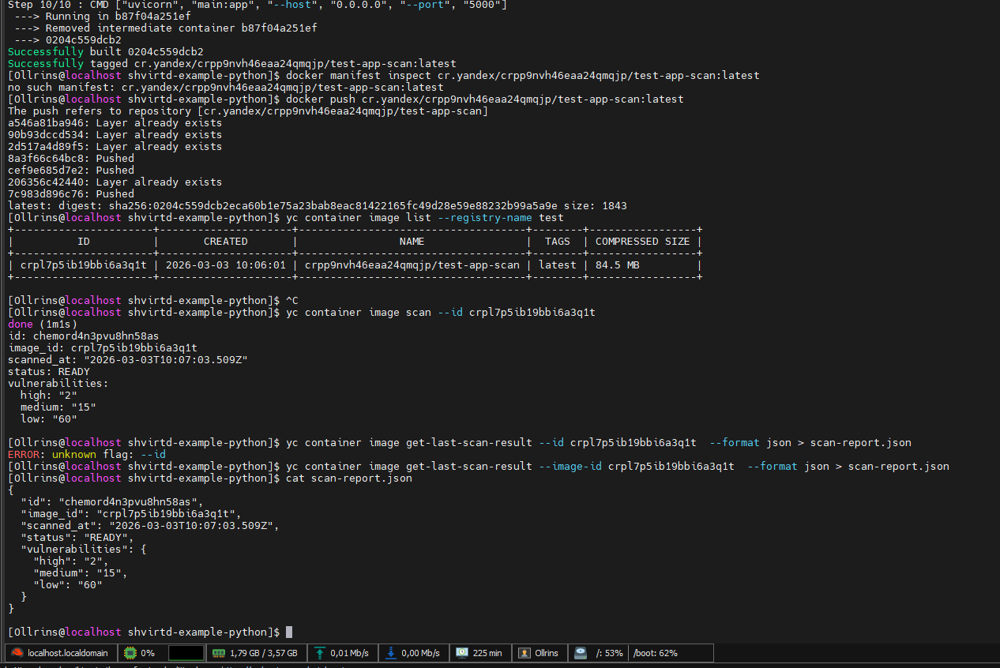
   
  <em>Рисунок 12 - Отчет сканирования</em>

## Задание 3

  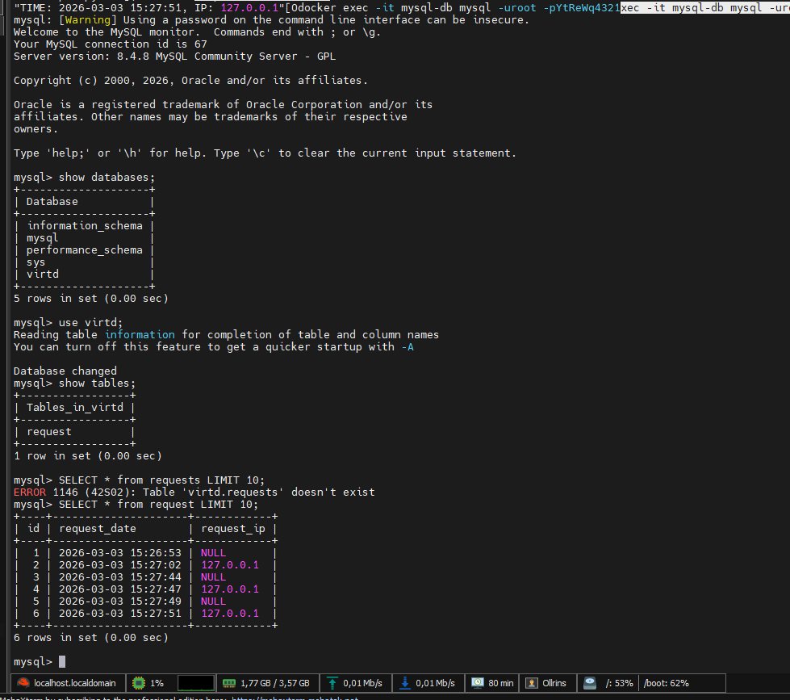
   
  <em>Рисунок 13 - Скриншот sql-запроса</em>

## Задание 4

  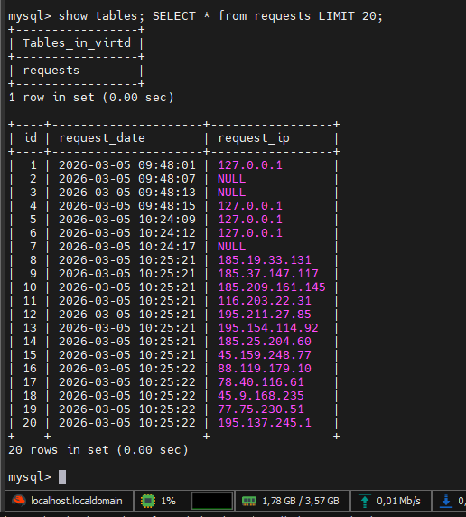
   
  <em>Рисунок 14 - Скриншот sql-запроса</em>   
  <em>Ссылка на fork https://github.com/Ollrins/shvirtd-example-python.git</em>

## Необязательная часть

  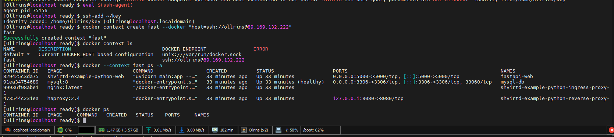
   
  <em>Рисунок 15 - Remote ssh context</em>

## Задание 5

  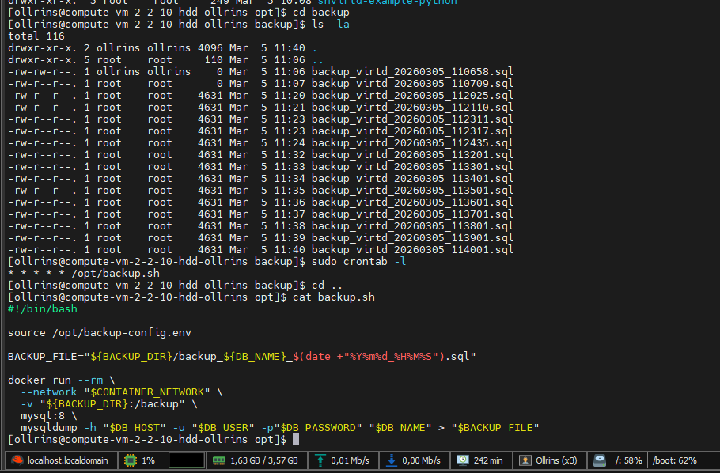
   
  <em>Рисунок 16 - Скрипт, cron-task и скриншот с несколькими резервными копиями в "/opt/backup" (из образа schnitzler/mysqldump не получилось) </em>

## Задание 6

  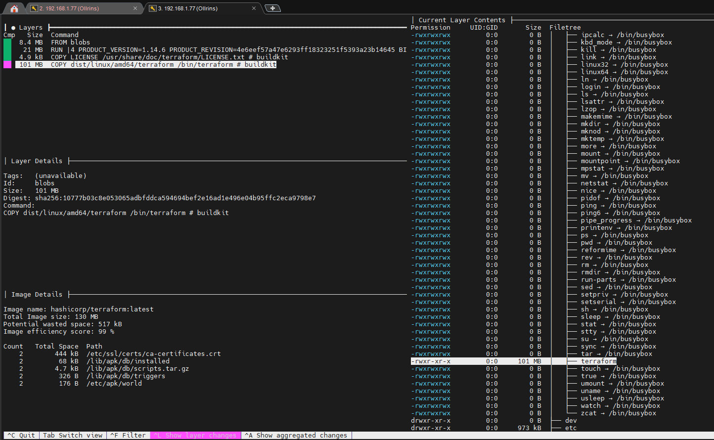
   
  <em>Рисунок 17 -Скриншот dive, вроде что-то пошло не так)</em>

  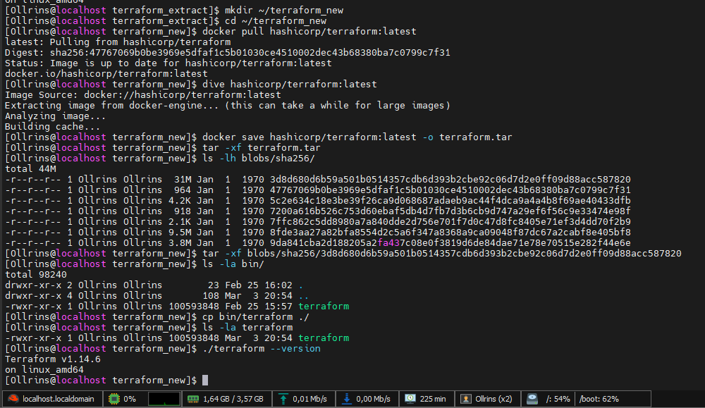
   
  <em>Рисунок 18 - Скриншот terraform</em>

## Задание 6.1

  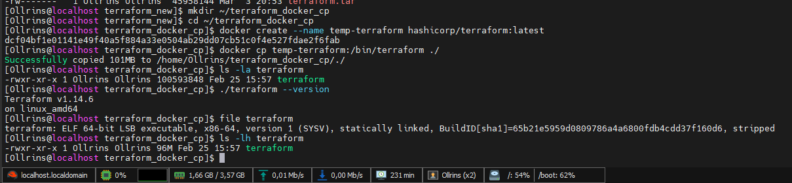
   
  <em>Рисунок 19 - Скриншот docker cp </em>

## Задание 6.2

  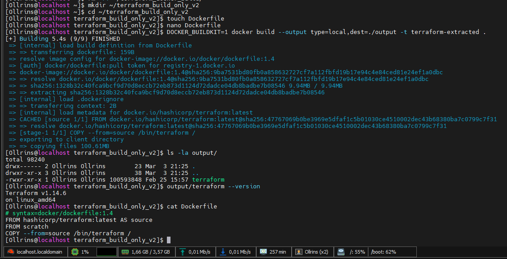
   
  <em>Рисунок 20 - Скриншот docker build и Dockerfile </em>

## Задание 7

  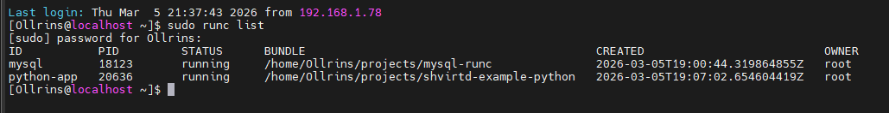
   
  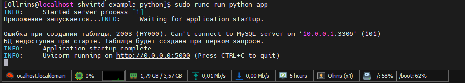
     
  <em>Рисунок 21 - Скриншот runC, дальше не получилось </em>

