# Домашнее задание к занятию 5. «Практическое применение Docker»

## Задание 1: FastAPI приложение с MySQL

### 1. Создание Dockerfile.python (single stage)

  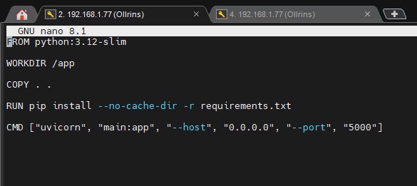
   
  <em>Рисунок 1 - Создание Dockerfile.python с базовым образом python:3.12-slim и конструкцией COPY .</em>

### 2. Создание .dockerignore

  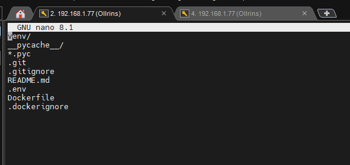
   
  <em>Рисунок 2 - Файл .dockerignore для исключения ненужных файлов</em>

### 3. Сборка и тестирование single stage образа

  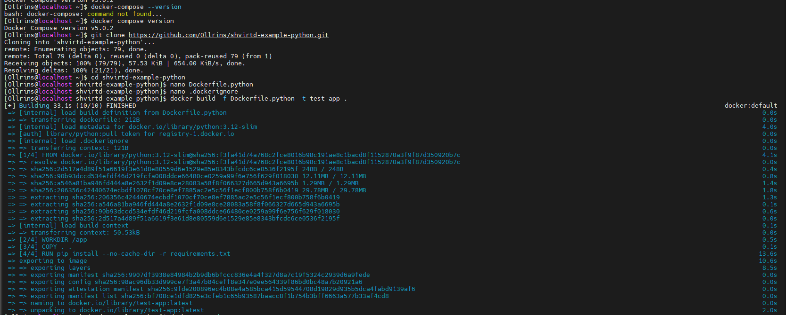
   
  <em>Рисунок 3 - Сборка образа командой docker build -f Dockerfile.python -t test-app .  Проверка работы приложения через curl http://localhost:5000 (получено предупреждение о неверном порте)</em>

### 4. Multistage сборка

  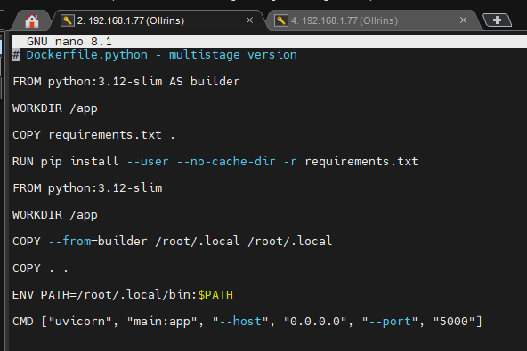
   
  <em>Рисунок 4 - Изменение Dockerfile.python на multistage сборку</em>

  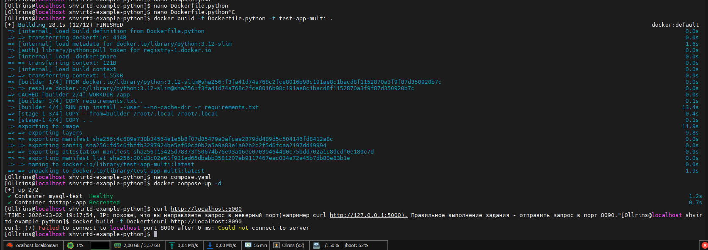
   
  <em>Рисунок 5 - Сборка multistage образа test-app-multi</em>

### 5. Запуск через docker-compose

  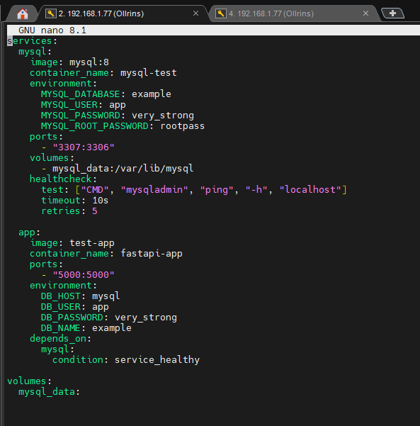
   
  <em>Рисунок 6 - Файл compose.yaml для запуска MySQL и приложения</em>

### 3.Проверка работы приложения через curl 

  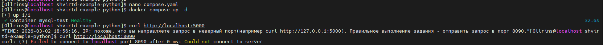
   
  <em>Рисунок 7 -  Проверка работы приложения через curl http://localhost:5000 (получено предупреждение о неверном порте)</em>

### 6. ✨ Запуск с venv (без Docker)

  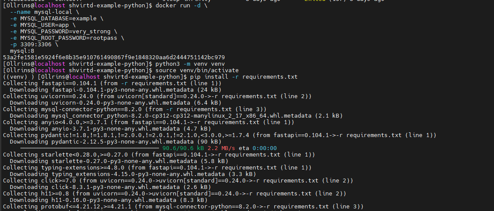
   
  <em>Рисунок 8 - Запуск MySQL в контейнере для локальной разработки. Создание и активация виртуального окружения, установка зависимостей. </em>

  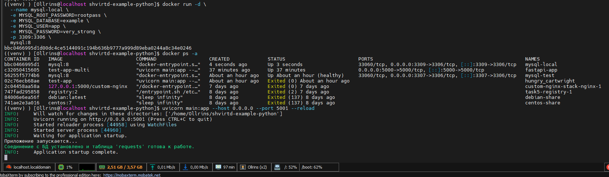
   
  <em>Рисунок 9 - Запуск приложения через uvicorn на порту 5001 (подключение к БД успешно)</em>

  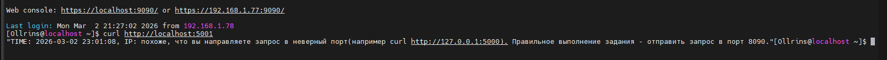
   
  <em>Рисунок 15 - Проверка работы приложения через curl (получено предупреждение)</em>

### 7. ✨ Добавление ENV переменной DB_TABLE

  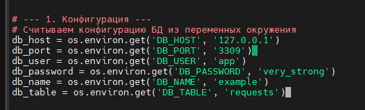
   
  <em>Рисунок 10 - Добавление переменной db_table в секцию конфигурации</em>

  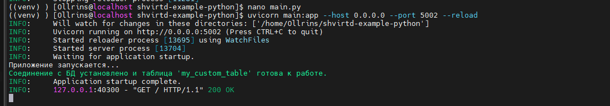
   
  <em>Рисунок 11 - Запуск приложения с DB_TABLE='my_custom_table' (таблица создана)</em>

  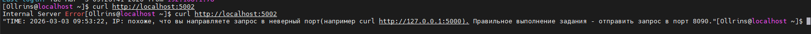
   
  <em>Рисунок 12 - Проверка работы с кастомной таблицей через curl</em>

### 8. Итоговые результаты

  
   
  <em>Рисунок 13 - Успешная работа приложения на порту 5002 с кастомной таблицей</em>

